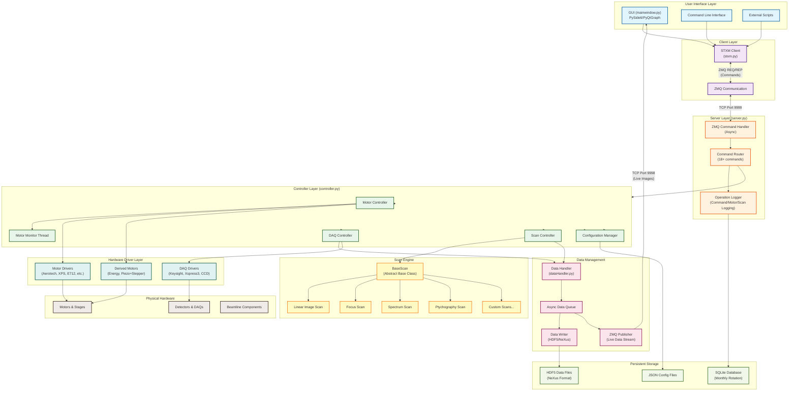
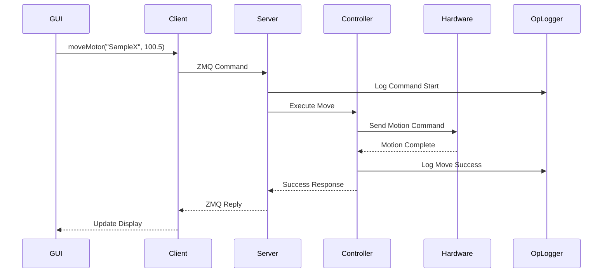
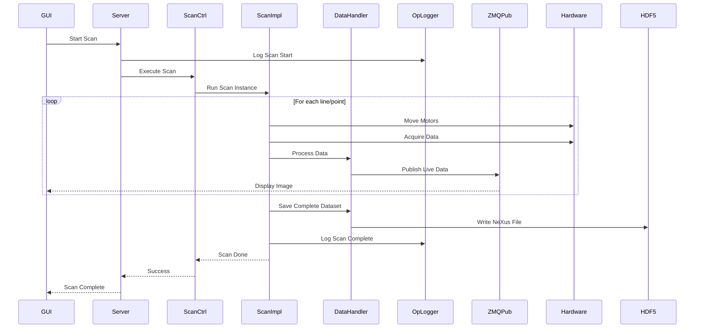
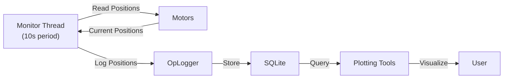
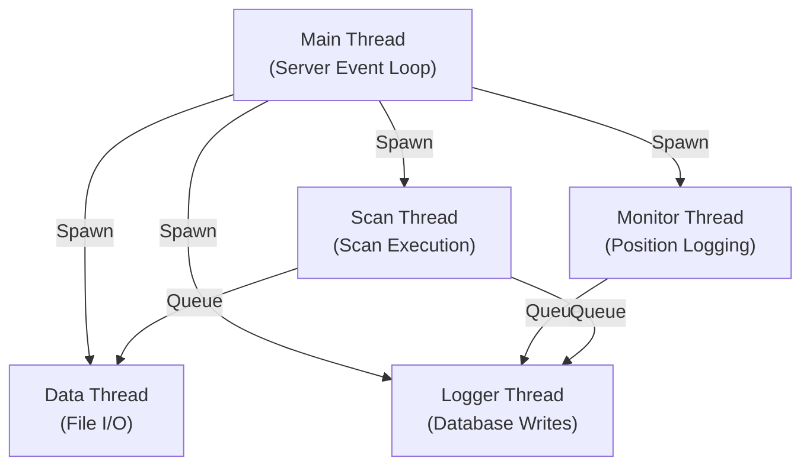
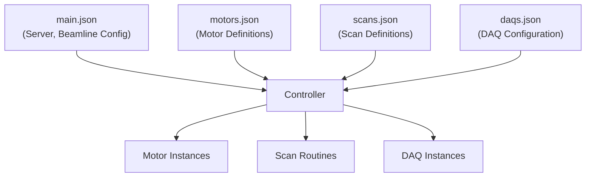

# pystxmcontrol Software Architecture

## System Overview

pystxmcontrol is a Python-based control system for Scanning Transmission X-ray Microscopy (STXM) at synchrotron beamlines. The architecture follows a client-server model with modular hardware drivers and flexible scan routines.

## High-Level Architecture Flowchart



## Component Details

### 1. User Interface Layer
- **GUI**: PySide6-based graphical interface with PyQtGraph for real-time visualization
- **CLI**: Command-line interface for scripting and automation
- **Scripts**: External Python scripts using the STXM client API

### 2. Client Layer
- **STXM Client**: High-level API for instrument control
- **ZMQ Communication**: Request/reply pattern for commands, publish/subscribe for data

### 3. Server Layer
- **ZMQ Command Handler**: Asynchronous command processing
- **Command Router**: Routes 18+ command types (moveMotor, scan, getData, etc.)
- **Operation Logger**: Logs all commands, motor moves, and scans to SQLite database

### 4. Controller Layer
- **Motor Controller**: Manages all motor instances and movements
- **DAQ Controller**: Manages data acquisition devices
- **Scan Controller**: Orchestrates scan execution in separate thread
- **Configuration Manager**: Loads and manages motor/scan/DAQ configurations
- **Motor Monitor**: Background thread for position monitoring

### 5. Data Management
- **Data Handler**: Coordinates data collection and storage
- **Data Writer**: Writes HDF5/NeXus formatted data files
- **Async Data Queue**: Decouples data collection from I/O
- **ZMQ Publisher**: Streams live data to GUI for real-time display

### 6. Scan Engine
- **BaseScan**: Abstract base class providing common scan functionality
  - DAQ configuration
  - Motor control
  - Energy handling
  - Timing management
- **Scan Implementations**:
  - Linear image scans
  - Focus scans
  - Spectroscopy scans
  - Ptychography scans
  - Custom user-defined scans

### 7. Hardware Driver Layer
- **Motor Drivers**: Support for multiple motor controllers
  - Aerotech (XY stages)
  - Newport XPS (precision positioning)
  - Physik Instrumente E712 (piezo)
  - EPICS motors
- **DAQ Drivers**: Data acquisition devices
  - Keysight counters/timers
  - Xspress3 fluorescence detector
  - Area detectors (CCD)
- **Derived Motors**: Virtual motors with special behavior
  - Energy motor (monochromator + focus coupling)
  - Piezo+Stepper (extended range positioning)

### 8. Physical Hardware
- **Motors & Stages**: Sample positioning, zone plate, OSA, detectors
- **Detectors**: Counters, fluorescence detectors, CCDs
- **Beamline Components**: Monochromator, shutters, gates

### 9. Persistent Storage
- **SQLite Database**: Operation logging (monthly rotation)
  - Motor positions
  - Motor moves
  - Scans
  - Commands
- **HDF5 Data Files**: Scientific data in NeXus format
- **JSON Config Files**: Motor, scan, and DAQ configurations

## Data Flow Diagrams

### Command Execution Flow



### Scan Execution Flow



### Motor Position Monitoring Flow



## Key Design Patterns

### 1. Client-Server Architecture
- **Separation**: GUI and control logic are separate processes
- **Communication**: ZMQ for efficient inter-process communication
- **Scalability**: Multiple clients can connect to one server

### 2. Abstract Base Class Pattern (BaseScan)
- **Common functionality**: Shared across all scan types
- **Extensibility**: Easy to add new scan types
- **Code reuse**: Reduces duplication

### 3. Async Queue Pattern
- **Non-blocking**: Motor moves don't wait for logging
- **Decoupling**: Data collection separate from I/O
- **Performance**: High-throughput data handling

### 4. Hardware Abstraction
- **Driver layer**: Isolates hardware-specific code
- **Polymorphism**: Controllers use common motor interface
- **Flexibility**: Easy to swap hardware

### 5. Observer Pattern
- **Live data**: ZMQ publisher broadcasts to subscribers
- **Real-time**: GUI updates during scans
- **Decoupled**: Data source independent of displays

## Threading Model



## Configuration Hierarchy



## File Organization

```
pystxmcontrol/
├── controller/
│   ├── controller.py          # Main controller
│   ├── server.py              # ZMQ server
│   ├── dataHandler.py         # Data management
│   ├── operation_logger.py    # Logging & analytics
│   ├── scans/
│   │   ├── base_scan.py       # Abstract base class
│   │   ├── linear_image.py    # Image scans
│   │   ├── linear_focus.py    # Focus scans
│   │   └── ...
│   └── zmq_publisher.py       # Live data stream
├── drivers/
│   ├── aerotechController.py  # Motor controllers
│   ├── derivedEnergy.py       # Energy motor
│   ├── derivedPiezo.py        # Piezo motors
│   ├── keysightCounter.py     # DAQ devices
│   └── ...
├── gui/
│   ├── mainwindow.py          # Main GUI
│   ├── scanRegion.py          # Scan region widgets
│   └── ...
├── utils/
│   ├── logger.py              # General logging
│   └── stxm.py                # Client API
└── stxmcontrol.py             # Entry point
```

## Extension Points

### Adding a New Scan Type

1. Create class inheriting from `BaseScan`
2. Implement `execute_scan()` method
3. Register in `scans/__init__.py`
4. Add to scan configuration

### Adding a New Motor Driver

1. Create driver class with standard interface
2. Implement `move()`, `getPos()`, `getStatus()`
3. Add configuration to `motors.json`
4. Controller automatically loads it

### Adding a New DAQ

1. Create DAQ driver class
2. Implement `config()`, `start()`, `getData()`
3. Add to `daqs.json`
4. Controller integrates automatically

## Performance Characteristics

- **Scan Rate**: Limited by motor speed and DAQ rate
- **Data Throughput**: ~100 MB/s via ZMQ streaming
- **Command Latency**: <10ms for motor commands
- **Logging Overhead**: <1ms per operation (async)
- **Database**: Monthly rotation prevents bloat
- **Memory**: Streaming minimizes RAM usage

## Fault Tolerance

- **Error Handling**: Graceful degradation on hardware failures
- **Scan Abort**: Clean shutdown on user cancel
- **Data Integrity**: WAL mode for SQLite, atomic HDF5 writes
- **Recovery**: Scans can be resumed from last completed region
- **Logging**: All operations logged for post-mortem analysis

---

**Version**: 1.0
**Date**: 2025-10-31
**Maintainer**: STXM Development Team
