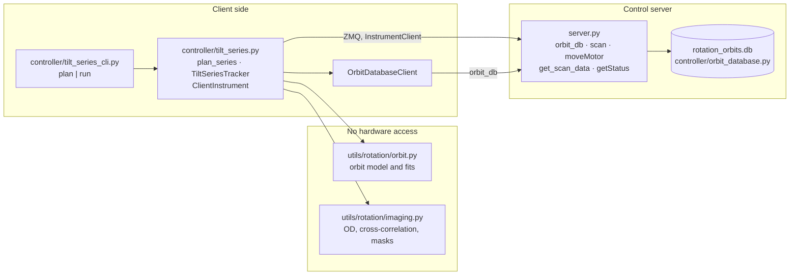

# Non-eucentric rotation tomography

Tools for running a tilt series when the CoarseR rotation axis does not pass through the
sample. As CoarseR turns, the sample moves on an orbit around the axis. It drifts sideways
in CoarseY and along the beam, so it leaves the field of view and goes out of focus. At
every angle, the motors have to be moved to where the sample now is before any data can
be taken.

The tools do three things:

1. **Predict** where the sample is at each angle from a short list of measured anchor
   positions, plus a history of orbits measured on previous samples.
2. **Track** the sample through the series: move to the prediction, find the sample with
   STXM images, centre on it and take ptychography.
3. **Record** every centred position. After you approve them, they add to the history
   that the next sample's prediction is based on.

This replaces the beamline script `rotation_tracker_260620.py` and its `cosmic_rotation`
helper package.

> **Status:** simulation-tested only, not bench-tested. Run in `debug` mode first (see
> [Running a series](#running-a-series)). Agent tools and a GUI are planned but not
> written yet ([What is not done yet](#what-is-not-done-yet)).

---

## Architecture



| Layer | File | Responsibility |
|---|---|---|
| Model | `pystxmcontrol/utils/rotation/orbit.py` | Orbit equations, global fit for GY, per-sample fit from anchors, prediction uncertainty |
| Image processing | `pystxmcontrol/utils/rotation/imaging.py` | OD from counts, despike, cross-correlation shift and confidence, sample mask, bounding-box centring |
| Storage | `pystxmcontrol/controller/orbit_database.py` | SQLite orbit history; `orbit_db` server command; network client; CSV import |
| Tracking | `pystxmcontrol/controller/tilt_series.py` | `TiltSeriesConfig`, `plan_series`, `TiltSeriesTracker`, `ClientInstrument` |
| Command line | `pystxmcontrol/controller/tilt_series_cli.py` | Runs a series from a JSON file without the GUI |
| Example | `scripts/tilt_series_example.json` | The 260620 Ni-edge series as a series file |

Design choices:

- **The model and image code never touch hardware**, so they can run and be tested
  offline. The tracker reaches the instrument only through the `InstrumentClient`
  interface (`send_message`, `get_status`, `getMotorPositions`, `motorInfo`,
  `scanConfig`). The headless scripter client, the GUI client and the agent client all
  provide that interface, so the same tracker can run under any of them.
- **No `pystxm_core` dependency.** The tracker asks the server for image counts with the
  existing `get_scan_data` command and computes OD locally with numpy. A client that
  can't see the server's data directory can still run a series.
- **The database lives on the server**, next to the beamline-parameter database, and is
  reached through the `orbit_db` command. This follows the same pattern as
  `beamline_db`. The command runs only methods on a fixed allowlist (`REMOTE_ACTIONS`).
  CSV import is not on it and has to run on the server machine.

---

## The orbit model

With φ = `scale` × CoarseR (`scale` = 0.89: the encoder reads larger than the physical
angle), a sample at distance P from the rotation axis follows

```
CoarseY    = AY + GY · P · sec φ + DY · tan φ
ZonePlateZ = AZ −      P · tan φ + DZ · sec φ
SampleX    = AX
```

- **AY, AZ, AX** are the sample's offsets and **P** is its orbit amplitude, all in µm.
  **DY, DZ** are small misalignment terms.
- **GY** is an instrument constant shared by every sample. It is fitted once, jointly
  across every sample in the history (`fit_global`).
- A new sample's parameters are fitted from its anchors with GY held fixed
  (`fit_from_anchors`). Y and Z share P. Near zero tilt, CoarseY barely changes with
  angle (sec φ ≈ 1), but ZonePlateZ does (tan φ is linear there). So the Z anchors pin
  down P, and **three anchors close to 0° are enough** for a first fit.
- **DY/DZ** are fitted only once there are at least 5 anchors spanning at least 40°
  (`auto_small_terms`). With fewer, they can't be separated from the offsets. You can
  override this with `use_small_terms`.
- `OrbitFit.predict_sigma` gives a 1σ uncertainty on the predicted CoarseY and
  ZonePlateZ at each angle. It is based on the fit covariance, with a separate noise
  level for each motor. It grows away from the anchors, which makes it a good guide to
  where the next anchor should go.

### ZonePlateZ is relative to the zone-plate calibration

Moving the Energy motor puts ZonePlateZ at the calibrated focus `A0 − A1·E`
(`derivedEnergy.getZonePlateCalibration`). The database stores each ZonePlateZ reading
as read, together with that calibration at the energy it was measured at. Fits work on
**Z relative to the calibration**. When the focus has been calibrated at 0° for the
sample, the relative Z at 0° is close to zero.

The practical effect is that anchors focused at one absorption edge correctly predict
focus at another. The old script did this with a hand-applied offset (`-1890.5`). Now
`plan_series` adds `A0 − A1·E_run` back for the run energy.

Points imported from the old CSV have no energy recorded, so their Z stays in raw motor
units. This doesn't affect the global fit, because every sample gets its own AZ.

---

## The orbit database

File: `<main.json server.data_dir>/pystxmcontrol_data/rotation_orbits.db`

- **`samples`**: `id`, `label`, `notes`, `created`, `created_by`.
- **`points`**:

| Column | Meaning |
|---|---|
| `angle` | CoarseR, encoder degrees (read back from the motor for tracked points) |
| `coarse_y`, `sample_x` | Where the sample was centred, µm. Follows the `SampleY = CoarseY` convention: the sample is centred with the fine Y piezo at 0 |
| `zone_plate_z` | ZonePlateZ as read (anchors) or as commanded (tracked) |
| `energy`, `zp_calibration`, `zp_offset` | Energy, `A0 − A1·E` and the ZonePlateZ motor offset at the time of measurement |
| `kind` | `anchor`, `tracked` or `import` |
| `approved` | Only approved points count toward fits |
| `z_measured` | 0 for tracked points: the tracker centres in X/Y but does not refocus, so their Z is the prediction |
| `cc_confidence`, `scan_file`, `notes` | Provenance |

### Approval lifecycle

- **Anchors** and **imports** are approved when written. They are deliberate
  measurements.
- **Tracked points** are written *pending*. At the end of a run the CLI asks whether to
  approve them; you can also call `approve_points(sample_id, point_ids=None)` or
  `discard_pending(sample_id)` later. Until approved, they don't count toward any fit.
- `orbit_samples()` is the list the global fit takes: approved points only, Z relative
  to calibration, and only samples with at least 3 points.

### Setup: import the old history once

Run this on the server machine:

```bash
python -m pystxmcontrol.controller.orbit_database import /global/software/scripts/tomo_orbit_motors.csv
python -m pystxmcontrol.controller.orbit_database list
```

The data directory comes from `main.json` (`server.data_dir`). Override it with
`--data-dir`, or with `--db <path>` for a scratch copy. Running the import twice creates
duplicate samples.

---

## Tracking one angle

`TiltSeriesTracker._track_angle`:

1. **Predict.** Take the planned target and add the last angle's measured-minus-model
   offset (`feed_forward`). A model error that grows steadily with tilt then can't walk
   the sample out of the coarse field.
2. **Move** CoarseR, CoarseY and ZonePlateZ (and, in XMCD mode, POLARIZATION, waiting
   for it to settle). **Verify** CoarseR and CoarseY: check, wait `settle_s`, check
   again, command the move once more, check a last time. If the motor still isn't there,
   the angle fails.
3. **Coarse image** (`coarse_range` / `coarse_points`) around the prediction.
4. **Find the sample.**
   - *First angle of a run:* threshold the coarse image, take the mask's bounding-box
     centre, and retake the coarse image there if it is more than `recenter_tol` off.
   - *Later angles:* cross-correlate with the previous angle's reference image. If the
     peak correlation is below `cc_tol`, the angle **fails** ("the sample is not where
     predicted"). Otherwise, take a **fine image** at the correlated position and
     recentre on its mask. With `threshold: "auto"`, if the background has drifted by
     more than `thresh_var_tol`, the fine image is retaken once. If the recentring moved
     more than `recenter_tol`, retake the coarse image there.
5. **Confirm.** The new reference must still correlate with the previous one at
   ≥ `cc_tol`.
6. **Ptychography** at the centre plus (`ptycho_shift_x`, `ptycho_shift_y`). In XMCD
   mode, flip the polarization and take a second one. The next angle starts at the
   flipped polarization, so the order alternates.
7. **Record** a pending tracked point in the database and a JSON line in `log_path`.

When an angle fails, the run stops there with a message naming the angle and the last
good one. `run(start_index=…)` resumes. The first resumed angle starts with a fresh
reference: it is centred from its own mask, not correlated with an earlier angle.

`stop()` ends the run after the current step. `stop(abort_scan=True)` also cancels the
scan in progress (Ctrl-C in the CLI does this).

### Two settings that would lose the focus

The server **moves ZonePlateZ back to its calibration** in two cases:

- a scan moves Energy (multi-energy scans always do; single-energy scans do when Energy
  is more than the 0.1 eV deadband away), or
- a scan has autofocus on. ScanModel turns autofocus on by default.

Either would undo the orbit's Z move, without any warning. So `TiltSeriesConfig.validate`:

- requires an explicit `energy_start` in both scan templates;
- requires both templates to be single-energy, at the **same** energy;
- forces `autofocus` off.

At the start of a run, the tracker also moves Energy to the series energy (if it isn't
within 0.05 eV), before the first ZonePlateZ move. This is why multi-energy
(spectro-tomography) series are rejected for now.

### Differences from the original script

| | Script | Here |
|---|---|---|
| CC confidence | Returned the array index of the correlation peak, so the `CC_TOL` check never fired | The peak normalised correlation, 0–1 |
| Cross-correlation | Direct `correlate2d`, seconds per image | FFT, same result |
| Reference image | Assumed centred | Its offset from centre is carried into the next correlation |
| Prediction | Model only | Model plus the last measured offset (`feed_forward`) |
| Energy / autofocus | Not controlled; the first angle could run at the calibrated focus | Set once at the start; autofocus forced off |
| Failure | `break`, nothing kept | Stops with a message; resumable; JSONL log |
| Scan templates | Unknown keys silently dropped (`sample=` set no sample name) | Rejected |
| Recording | None | Pending tracked points for approval |
| `show_mask` / `show_hist` | Blocking matplotlib windows | Removed; threshold and confidences are in each `AngleResult` |

---

## Running a series

### 1. Anchors

Measure each anchor by hand at the start. The task-agent tools planned for this step
don't exist yet.

1. At about 0°, find the sample in a large STXM image, centre it with the fine Y piezo
   at 0 (`SampleY = CoarseY`), **focus**, and note CoarseR, CoarseY, SampleX and
   ZonePlateZ.
2. Repeat at two more angles near 0° (for example ±10°). The sample moves only a few µm
   in Y over ±10°; most of the motion is in Z, so refocus each time.
3. Run `plan` (below) to fit and view the predicted orbit with its ± uncertainties.
   Step outward, taking anchors where the uncertainty is largest. A prediction with
   small ± makes the next anchor easy to find.

### 2. Series file

Copy `scripts/tilt_series_example.json`.

| Key | Purpose |
|---|---|
| `server` | `host` / `port`; defaults to `main.json` `server.stxm_address` / `command_port` |
| `sample` | `{"label": …}` for a new sample, or `{"sample_id": N}` to use a database sample's approved points as anchors, and to resume |
| `anchors` | List of `{angle, coarse_y, sample_x, zone_plate_z, energy}`. `energy` is the energy the anchor was focused at; if left out, the series energy is assumed |
| `angles` | A list, `{"start", "stop", "step"}` (stop inclusive), or several ranges merged, e.g. fine steps near 0° and coarse steps at large tilt |
| `tracker` | `TiltSeriesConfig` fields (table below) |
| `GY`, `use_small_terms` | Optional overrides for the fit |
| `log_path` | JSON-lines record, one line per completed angle |

`tracker` fields (distances in µm):

| Field | Default | |
|---|---|---|
| `stxm_scan` | Spiral Image, 0.2 ms | Tracking-image template (ScanModel fields); **must** set `energy_start` |
| `ptycho_scan` | `null` | Ptychography template; `null` tracks without taking data |
| `coarse_range` / `coarse_points` | 20 / 100 | Correlation image |
| `fine_range` / `fine_points` | 15 / 75 | Centring image |
| `threshold` | 0.3 | Mask threshold as a fraction of the OD maximum, or `"auto"` (background Gaussian + 5σ) |
| `align_to_fiducial` | false | Track transmitted counts of the cropped spiral image, not OD |
| `open_kernel` / `close_kernel` | 3 / 3 | Mask morphology |
| `ptycho_shift_x` / `_y` | 0 / 0 | Ptychography centre relative to the sample |
| `cc_tol` | 0.6 | Minimum peak correlation |
| `thresh_var_tol` | 0.25 | `"auto"` background drift allowed before the fine image is retaken |
| `recenter_tol` | 0.5 | Retake the coarse image when the recentring moves more than this |
| `feed_forward` | true | Add the last measured offset to the next prediction |
| `rotation_motor` / `y_motor` / `z_motor` | CoarseR / CoarseY / ZonePlateZ | |
| `rotation_tol` / `y_tol` | 0.3° / 1.0 | Move verification |
| `settle_s` | 5 | Wait before re-checking a motor |
| `xmcd`, `polarization_motor`, `polarization_start`, `polarization_tol`, `polarization_timeout_s` | off, POLARIZATION, 1.0, 0.1, 60 s | Paired opposite-polarization ptychography |
| `debug` | false | Move motors only: no scans, no Energy move, no database writes |

### 3. Plan, dry run, run

```bash
# Fit and print the predicted orbit; moves nothing.
python -m pystxmcontrol.controller.tilt_series_cli plan series.json

# First time on the instrument: set "debug": true and watch the motors follow the orbit.
python -m pystxmcontrol.controller.tilt_series_cli run series.json

# The real run. Asks before starting (skip with --yes).
python -m pystxmcontrol.controller.tilt_series_cli run series.json
```

`plan` prints GY, the number of history samples it came from, the fitted parameters,
the anchor rms and the run's zone-plate calibration, then one line per angle:

```
 CoarseR    CoarseY      ±   SampleX  ZonePlateZ      ±
   -80.0      354.8    2.7     -85.0    -11254.2    3.1
   ...
```

A `run` that isn't in debug mode first creates the database sample (if needed) and
records the file's anchors, printing the sample id. Pass the id back as
`"sample": {"sample_id": N}` to resume.

### 4. Resume and approve

- A failed or stopped run prints `resume with: --start N`. Set `sample_id` in the file
  and run again with `--start N`. Anchors already in the database aren't recorded twice.
- At the end, the CLI offers the tracked positions for approval: `y` approves them,
  `discard` deletes them, and anything else leaves them pending.

### From Python

```python
from pystxmcontrol.controller.instrument_client import ScripterClient
from pystxmcontrol.controller.scripter import scripter
from pystxmcontrol.controller.orbit_database import OrbitDatabaseClient
from pystxmcontrol.controller.tilt_series import (
    ClientInstrument, TiltSeriesConfig, TiltSeriesTracker, plan_series)

client = ScripterClient(scripter("131.243.73.81", 9999)); client.get_config()
inst, db = ClientInstrument(client), OrbitDatabaseClient(client)
config = TiltSeriesConfig.from_dict({...})            # as in the series file
plan = plan_series(anchors, {"start": -80, "stop": 72, "step": 2},
                   db.orbit_samples(), energy=config.energy,
                   zp_calibration=inst.zp_calibration)
print(plan.table())
result = TiltSeriesTracker(inst, config, plan.targets, db=db, sample_id=sid).run()
```

---

## Tests

```bash
python -m pytest tests/test_rotation.py tests/test_tilt_series.py
```

- `test_rotation.py` checks the model against predictions captured from the original
  script (`tests/data/rotation/orbit_reference_260620.json`, which matches it to
  1e-6 µm). It also checks the FFT correlation against `correlate2d` and covers the
  database and the client round-trip.
- `test_tilt_series.py` runs the tracker against a simulated instrument. The simulation
  renders a noisy sample along a true orbit that differs from the planned one, and
  copies the server's ZonePlateZ resets on Energy moves and autofocus. The tests cover
  tracking, feed-forward, losing the sample, resume, stop, motor failure, debug, XMCD,
  `"auto"` threshold, template validation, and moving anchors from one edge's energy to
  another's.

## What is not done yet

- **Bench test.** Nothing here has driven the instrument.
- **Anchor energy for the 260620 data.** In `tilt_series_example.json` the anchors are
  set to 708 eV, but that is a guess. The script's `−1890.5` offset is 142.7 eV ×
  13.24 µm/eV, while its scans ran at 835.5 eV, which would put the anchors near 693 eV.
  Check the energy the anchors were focused at, and the beamline's A1.
- **Task-agent tools** (`agent_tools/rotation.py`) for the anchor step: rotate, find,
  centre, focus, record, fit, suggest the next anchor. Plus a background tilt series the
  agent can start, watch and stop.
- **Multi-energy series**, which need Energy and ZonePlateZ moved together at each angle.
- **GUI**: the dashboard's placeholder "Tomography" scan type.
